# basvankuijck Home Assistant configuration

 

I finally managed to cleanup my `/config` directory and refactor a sh*tload in order to be more futureproof and be able to share it on GitHub.   
> Disclaimer:   
> I got a lot of inspiration from [adonno](https://github.com/adonno/Home-AssistantConfig) his configuration, so a big shoutout to him.

## History

My first experience with smart homes was when I bought a set of KlikAanKlikUit (kaku) outlets to turn some of the (unreachable) lights on and off.   
After a while I bought a Raspberry PI with a 433Mhz transmitter that would be able to control some of my lights through Homekit with [Homebridge](https://github.com/nfarina/homebridge).    
But after a while the limitations of Homekit came to light and after some searching I stumbled upon Home Assistant and have never looked back since.

## Protocols

In my current setup the main communication between smart 'devices' is done throught the following protocols:

| Zigbee | 433Mhz | MQTT | Sonoff |
|:------:|:------:|:----:|:----:|
|||||

## Hardware

### Host 

A Raspberry PI 3B with a 32GB SD card in a case with extra heatsinks fans and a 5.1V/2.5A power adapter.

### Backbone

| Device | Amount | More Info | Image | Cost |
| -------- |:-----------:|:---:|:---:|:---:|
| **Raspberry Pi 3B** | **1x** | [Raspberry Pi 3B](https://www.sossolutions.nl/officiele-raspberry-pi-3b-starterkit) | 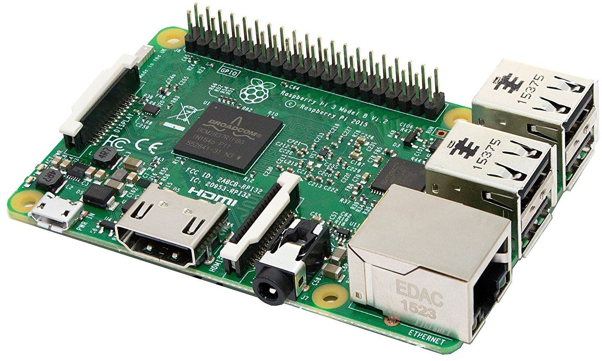 |€ 59|
| **Sandisk Micro SDXC 64GB** | **1x** | [SANDISK MicroSD Extreme Plus 64GB 170MB](https://www.mediamarkt.nl/nl/product/_sandisk-microsd-extreme-plus-64gb-170mb-1587891.html) |  |€ 26|

### 433Mhz 'Stuff'

| Device | Amount | More Info | Image | Cost |
| -------- |:-----------:|:---:|---:|:---:|
| **ACD-200** |  **1x** | [KlikAanKlikUit ACD-200](https://www.klikaanklikuit.nl/nl/producten/ontvangers/stopcontact/acd-200-stopcontact-dimmer-200w-multi-nederlandse-stekker.html) | 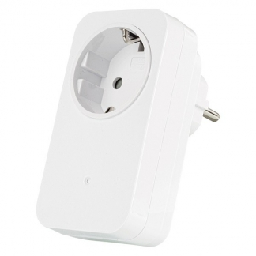 |€ 24|
| **AWMR-300** | **1x** | [KlikAanKlikUit AWMR-300](https://www.klikaanklikuit.nl/nl/producten/ontvangers/inbouw/awmr-300-mini-inbouw-schakelaar.html) | 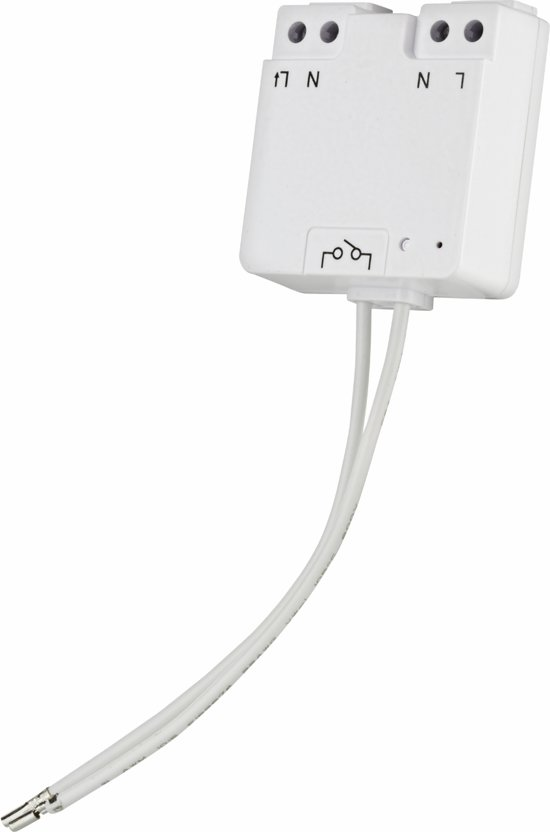 |€ 25|
| **AGDR-300** | **1x** | [KlikAanKlikUit AGDR-300](https://www.klikaanklikuit.nl/nl/producten/ontvangers/stopcontact/agdr-300-stopcontactdimmer-buiten-300w.html) | 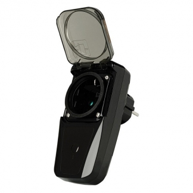 |€ 25|

### Modules

| Device | Amount | More Info | Image | Cost |
| -------- |:-----------:|:---:|---:|:---:|
| **NodeMCU v2** | **2x** | [ESP8266 NodeMCU V2](https://www.tinytronics.nl/shop/nl/communicatie/esp8266-nodemcu-v2) | 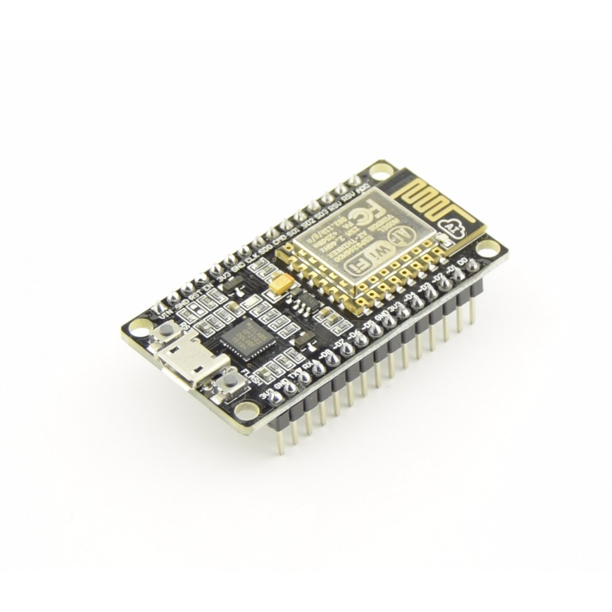 |€ 16|
| **RF Transmitter** | **2x** | [433Mhz RF Transmitter](https://www.amazon.com/SMAKN®-433Mhz-Transmitter-Receiver-Arduino/dp/B00M2CUALS) | 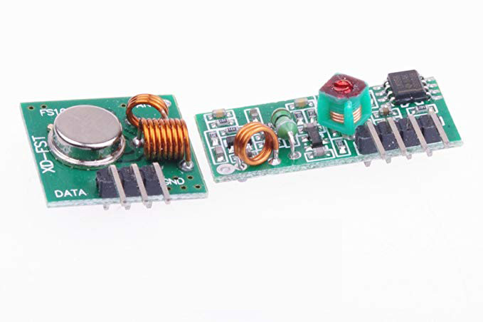 |€ 2|

### Sonoff

| Device | Amount | More Info | Image | Cost |
| -------- |:-----------:|:---:|---:|:---:|
| **Sonoff Basic R3** | **2x** | [Sonoff Basic R3](https://www.itead.cc/smart-home/sonoff-basicr3-wifi-diy-smart-switch.html) | 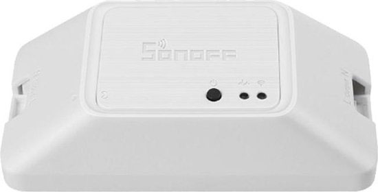 |€ 12|

### Cameras

| Device | Amount | More Info | Image | Cost |
| -------- |:-----------:|:---:|---:|:---:|
| **Besder IP Camera** | **2x** | [BESDER Bullet IP Camera Wi-fi Outdoor 1080P](https://aliexpress.com/item/32852462138.html?spm=a2g0s.9042311.0.0.27424c4dok4dP9) | 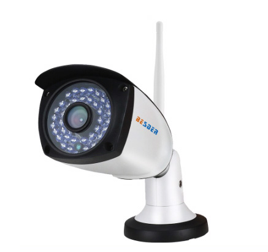 |€ 72|
| **Yi Home 1080p** | **1x** | [Yi Home 1080p](https://www.yitechnology.com/yi-1080p-home-camera) |  |€ 23|

### Zigbee

| Device | Amount | More Info | Image | Cost |
| -------- |:-----------:|:---:|---:|:---:|
| **Conbee II** | **1x** | [Phoscon Conbee II](https://www.phoscon.de/en/conbee2) | 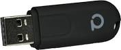 |€ 40|
| **Xiaomi Motion Sensor** | **1x** | [Xiaomi Aqara motion sensor](https://aliexpress.com/item/32999497769.html?spm=a2g0s.9042311.0.0.48284c4dyCxoo5) |  |€ 12|
| **Xiaomi Door Sensor** | **1x** | [Xiaomi Aqara Door sensor](https://aliexpress.com/item/33003371330.html?spm=a2g0s.9042311.0.0.48284c4dyCxoo5) | 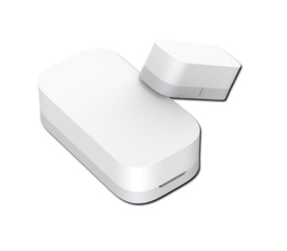 |€ 11|
| **TRÅDFRI Smart Plug** | **2x** | [IKEA TRÅDFRI Smart Plug](https://www.ikea.com/nl/nl/p/tradfri-draadloos-plug-in-stopcontact-90356166/) |  |€ 10|
| **TRÅDFRI Light Bulb** | **1x** | [IKEA TRÅDFRI Bulb E27 opal 1000lm](https://www.ikea.com/nl/nl/p/tradfri-led-e27-1000-lumen-draadloos-dimbaar-wit-spectrum-opaalwit-60408483/) |  |€ 18|
| **TRÅDFRI LED Spot** | **5x** | [IKEA TRÅDFRI GU10 400lm](https://www.ikea.com/nl/nl/p/tradfri-led-lamp-gu10-400-lumen-draadloos-dimbaar-warm-wit-60420041/) |  |€ 30|
| **TRÅDFRI Switch Rocker** | **1x** | [IKEA TRÅDFRI Wireless Rocker](https://www.ikea.com/nl/nl/p/tradfri-draadloze-dimmer-wit-70408595/) | 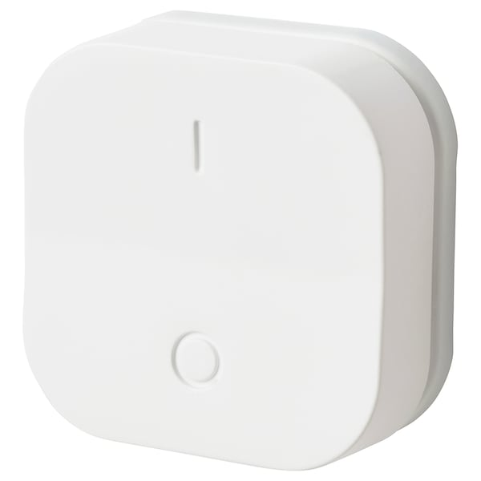 |€ 7|
| **TRÅDFRI LED Spectrum Spot** | **1x** | [IKEA TRÅDFRI GU10 White Spectrum 400lm](https://www.ikea.com/nl/nl/p/tradfri-led-lamp-gu10-400-lumen-draadloos-dimbaar-wit-spectrum-90408603/) | 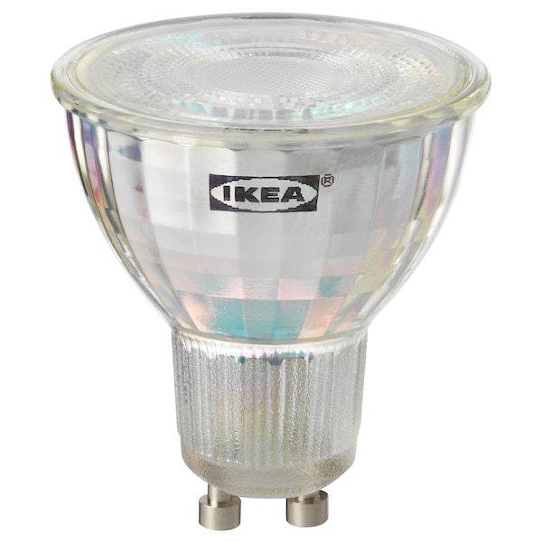 |€ 12|
| **iCasa Filament bulb** | **5x** | [iCasa Zigbee Filament LED lamp | 125mm](https://www.bol.com/nl/p/zigbee-filament-led-lamp-125mm-instelbaar-2700k-tot-6500k-vervangt-60w-gloeilamp-grote-fitting-e27-compatible-met-philips-hue-ikea-home-smart/9200000117123523/?bltgh=htufFpaP--RUc61zlhJIfQ.1_5.11.ProductTitle) |  |€ 85 |

### Thermostat

| Device | Amount | More Info | Image | Cost |
| -------- |:-----------:|:---:|---:|:---:|
| **TOON** | **1x** | [Eneco TOON](https://www.eneco.nl/toon-thermostaat/) | 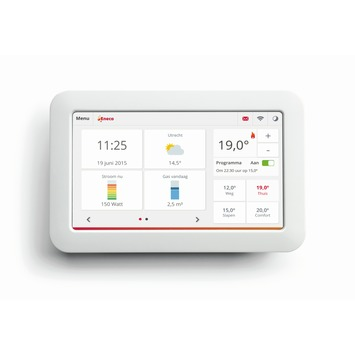 | € 0|

### Misc

| Device | Amount | More Info | Image | Cost |
| -------- |:-----------:|:---:|---:|:---:|
| **iPad Air** *(Wall mounted dashboard)* | **1x** | [Apple iPad Air](https://www.apple.com/nl/ipad-air/) |  |€ 300|
| **Mac Mini** *(Used as a DSR)* | **1x** | [Apple Mac Mini](https://www.apple.com/mac-mini/) |  |€ 700|
| **Ring Doorbell** | **1x** | [Ring Doorbell Pro](https:///ring.com/products/video-doorbell-pro-with-plug-in-adapter) |  |€ 179|

### AV

| Device | Amount | More Info | Image | Cost |
| :-------- |:-----------:|:---:|---:|:---:|
| **Chromecast** | **2x** | [Google Chromecast V1](https://store.google.com/product/chromecast) |  |€ 20|
| **Apple TV** | **1x** | [AppleTV V1](https://www.apple.com/tv/) |  |€ 60|
| **Google Home** | **1x** | [Google Home Mini](https://store.google.com/product/google_home_mini) | 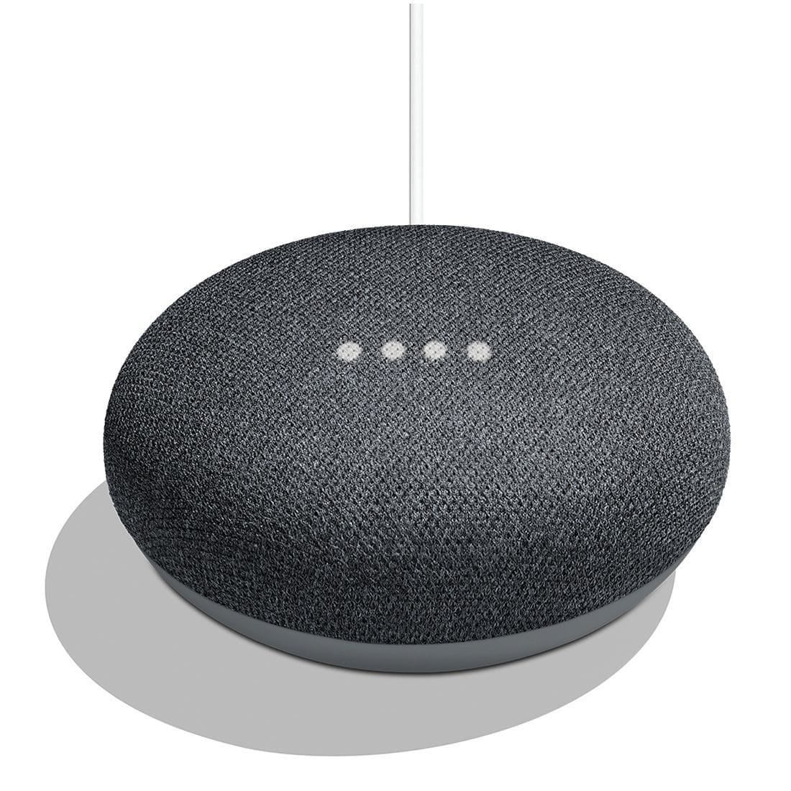 |€ 20|

## Total cost
(So far) € 1.849,- (includes removed / replaced stuff)

## Wishlist / To do

Everything I intend to upgrade in my hassio setup I create a github issue.   
[See all open issues](https://github.com/basvankuijck/homeassistant-config/issues).

Probably a lot of them won't ever see the daylight, but if I come across some intereseting stuff my initial action would be to create an issue.