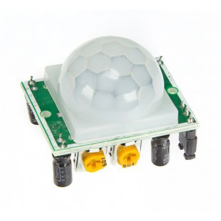
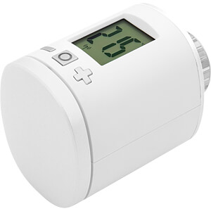

# basvankuijck Home Assistant configuration

I finally managed to cleanup my `/config` directory and refactor a sh*tload in order to be more futureproof and be able to share it on GitHub.   
> Disclaimer:   
> I got a lot of inspiration from [adonno](https://github.com/adonno/Home-AssistantConfig) his configuration, so a big shoutout to him.

## History

My first experience with smart homes was when I bought a set of KlikAanKlikUit (kaku) outlets to turn some of the (unreachable) lights on and off.   
After a while I bought a Raspberry PI with a 433Mhz transmitter that would be able to control some of my lights through Homekit with [Homebridge](https://github.com/nfarina/homebridge).    
But after a while the limitations of Homekit came to light and after some searching I stumbled upon Home Assistant and have never looked back since.

## Hardware

### Host 

A Raspberry PI 3B with a 32GB SD card in a case with extra heatsinks fans and a 5.1V/2.5A power adapter.

### Outlets

| Device | Amount | More Info | Image |
| -------- |:-----------:|:---:|---:|
| **ACD-200** | **4x** | [KlikAanKlikUit ACD-200](https://www.klikaanklikuit.nl/nl/producten/ontvangers/stopcontact/acd-200-stopcontact-dimmer-200w-multi-nederlandse-stekker.html) |  |
| **AWMR-300** | **1x** | [KlikAanKlikUit AWMR-300](https://www.klikaanklikuit.nl/nl/producten/ontvangers/inbouw/awmr-300-mini-inbouw-schakelaar.html) |  |
| **AGDR-300** | **2x** | [KlikAanKlikUit AGDR-300](https://www.klikaanklikuit.nl/nl/producten/ontvangers/stopcontact/agdr-300-stopcontactdimmer-buiten-300w.html) |  |

### Modules

| Device | Amount | More Info | Image |
| -------- |:-----------:|:---:|---:|
| **NodeMCU v2** | **3x** | [ESP8266 NodeMCU V2](https://www.tinytronics.nl/shop/nl/communicatie/esp8266-nodemcu-v2) |  |
| **RF Transmitter** | **2x** | [433Mhz RF Transmitter](https://www.amazon.com/SMAKN®-433Mhz-Transmitter-Receiver-Arduino/dp/B00M2CUALS) |  |
| **PIR** | **1x** | [PIR Motion sensor](https://www.elektor.nl/hc-sr501-pir-motion-sensor-module?gclid=Cj0KCQjww7HsBRDkARIsAARsIT4ndV5yKpz4TDB5ZA8-7x4do_JWC9dJzpfOr2MtLILT1Lr6tIO7N3saAtw7EALw_wcB) |  |

### Cameras

| Device | Amount | More Info | Image |
| -------- |:-----------:|:---:|---:|
| **Besder IP Camera** | **2x** | [BESDER Bullet IP Camera Wi-fi Outdoor 1080P](https://aliexpress.com/item/32852462138.html?spm=a2g0s.9042311.0.0.27424c4dok4dP9) |  |

### Zigbee

| Device | Amount | More Info | Image |
| -------- |:-----------:|:---:|---:|
| **Conbee II** | **1x** | [Phoscon Conbee II](https://www.phoscon.de/en/conbee2) |  |
| **Xiaomi Motion Sensor** | **1x** | [Xiaomi Aqara motion sensor](https://aliexpress.com/item/32999497769.html?spm=a2g0s.9042311.0.0.48284c4dyCxoo5) |  |
| **Xiaomi Door Sensor** | **1x** | [Xiaomi Aqara Door sensor](https://aliexpress.com/item/33003371330.html?spm=a2g0s.9042311.0.0.48284c4dyCxoo5) |  |

### Thermostat

| Device | Amount | More Info | Image |
| -------- |:-----------:|:---:|---:|
| **TOON** | **1x** | [Eneco TOON](https://www.eneco.nl/toon-thermostaat/) |  |

### Misc

| Device | Amount | More Info | Image |
| -------- |:-----------:|:---:|---:|
| **iPad Air** *(Wall mounted dashboard)* | **1x** | [Apple iPad Air](https://www.apple.com/nl/ipad-air/) |  |
| **Mac Mini** *(Used as a DSR)* | **1x** | [Apple Mac Mini](https://www.apple.com/mac-mini/) |  |

### AV

| Device | Amount | More Info | Image |
| :-------- |:-----------:|:---:|---:|
| **Chromecast** | **2x** | [Google Chromecast V1](https://store.google.com/product/chromecast) |  |
| **Apple TV** | **1x** | [AppleTV V1](https://www.apple.com/tv/) |  |
| **Google Home** | **1x** | [Google Home Mini](https://store.google.com/product/google_home_mini) |  |

## Wishlist / To do

Currently the lights are controled using a 433Mhz transmitter communicating with the KaKu smart outlets.   
Sometimes these outlets will not respond and after a couple of hours they seem to be responding again.   
Therefore I'm in the progress of replacing them with 'smart' outlets that support the Zigbee protocol. So I can hook [them](https://github.com/dresden-elektronik/deconz-rest-plugin/wiki/Supported-Devices#supported-wireless-switches) up to my Zigbee mesh / deCONZ setup.

- [ ] Replace 433Mhz KaKu with Zigbee alternatives
- [ ] Z-Wave compatibility
- [ ] Intel NUC Barebone
- [ ] Alarm panel, maybe even with NFC
- [ ] Replace traditional smoke alarms with "smart" ones

| Device | Why | Image |
| :-------- |:-----------|---:|
| **Eurotronic Spirit ZigBee** | In order to control the radiators in my kids' bedrooms. They tend to leave them on :) |  |
| **Alarm panel** | I got a spare iPad mini laying around that could function as a wall mounted alarm panel.|  |
